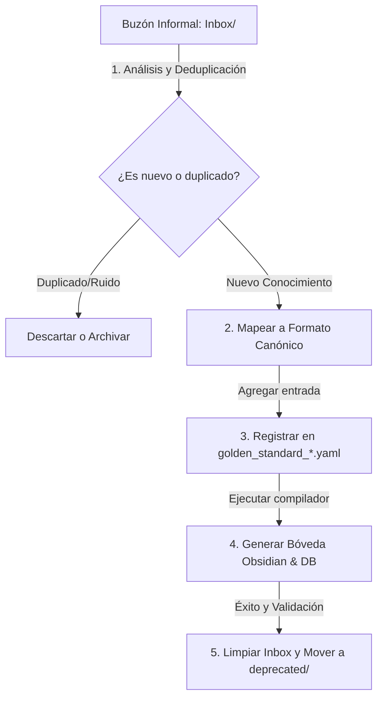

# Inbox — Golden Standard Ingestion Protocol

Este directorio actúa como el **Raw Inbox** (buzón de entrada) según el patrón **LLM Wiki**. Aquí se deposita el conocimiento informal, bitácoras de incidentes, logs y aprendizajes sueltos de vibe coding antes de ser purificados y consolidados en el estándar.

---

## Flujo de Ingesta y Promoción



### Paso 1: Recibir Hallazgos
Cualquier sesión de vibe coding, test fallido recurrente, o error de tokenomics debe registrarse en un archivo `.md` rápido dentro de esta carpeta (ej. `Inbox/error_context_handling.md`).

### Paso 2: Análisis y Purificación
El agente o el DRI humano revisará el buzón periódicamente:
1. Comprobar contra los catálogos YAML si la falla/symptom ya está cubierta.
2. Si es nueva, extraer: **Symptom**, **Cause**, **Solution**, **Prevention Action** y su **Validating Mechanism**.

### Paso 3: Promoción
1. Agregar la entrada bajo el dominio correspondiente (`VC-xxx`, `TV-xxx`, `TK-xxx`) en su respectivo archivo YAML de `Golden_Standard/`.
2. Mantener la numeración secuencial estricta.

### Paso 4: Compilación y Cierre
1. Ejecutar el script compilador:
   ```bash
   python scripts/generate_golden_audit.py
   ```
2. Confirmar que la bóveda Obsidian (`Wiki/`) se actualice con el nuevo enlace bidireccional y que las pruebas de cumplimiento de Cerberus pasen en verde.
3. Trasladar el archivo del `Inbox/` original a `deprecated/Golden_Standard/Inbox/` para mantener limpio el espacio de producción.
