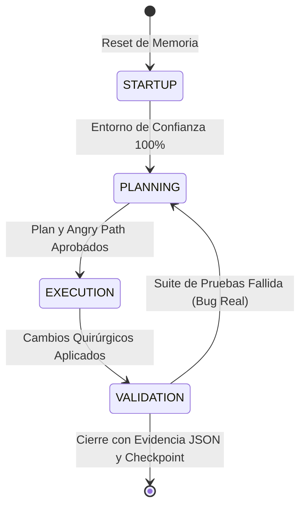

# Vibe Coding Anti-patterns Library

## Propósito

Base actionable de vicios de generación automatizada. Cada fila debe permitir detectar el fallo, nombrar la causa y aplicar una barrera preventiva.

## Uso operativo

- **Detectar**: Buscar el síntoma operativo.
- **Diagnosticar**: Leer la causa raíz teórica.
- **Prevenir**: Aplicar el principio de solución agnóstica.
- **Escalar**: Si un vicio afecta estado, seguridad, datos, pruebas o entrega, bloquear cierre hasta evidenciar corrección.

## Regla de densidad cognitiva

No se busca menos prosa; se busca máxima orientación. Cada entrada debe concentrar atención en tres operaciones: detectar el vicio, entender la falla sistémica y aplicar una barrera. Si una ampliación no mejora esas tres operaciones, distrae.

## Regla anti-deriva

Esta biblioteca no es backlog de mejoras ni generador de side projects. Si una entrada revela trabajo lateral, se registra como riesgo o bloqueo; no desplaza el objetivo actual.

## Política de no simulación

No se acepta ningún mecanismo que haga pasar una verificación sin implementar el comportamiento real: placeholders, stubs, wrappers de conveniencia, rutas hardcodeadas, aprobaciones codificadas, silenciamiento de errores, tolerancia de warnings o excepciones esperadas. Si el sistema necesita una excepción para verse sano, el sistema no está sano.

---

## Categoría I: Sesgos Epistemológicos y de Conducta

| ID | Anti-patrón / Vicio | Síntoma operativo | Causa raíz teórica | Principio de solución agnóstica |
|---|---|---|---|---|
| VC-001 | Incompetencia no asumida | Se acepta salida generada como correcta | Ausencia de adversarialidad epistemológica | Tratar toda salida como hipótesis hasta validación |
| VC-002 | Complacencia generativa | El sistema responde con seguridad injustificada | Optimización por plausibilidad | Exigir incertidumbre explícita y evidencia |
| VC-003 | Triunfalismo sin prueba | Se declara éxito sin logs | Confusión entre afirmación y verificación | Prohibir veredictos sin evidencia observable |
| VC-004 | Demo como calidad | Algo funciona superficialmente | Muestreo insuficiente del estado | Validar flujo, límites y persistencia |
| VC-005 | Prototipo convertido en deuda | Lo temporal queda permanente | Falta de frontera de expiración | Todo prototipo debe tener fecha, dueño y salida |
| VC-006 | Estética como integridad | UI o docs bonitos ocultan fallos | Señal visual sustituye causalidad | Validar lógica antes que presentación |
| VC-007 | Auditoría no humana del core | Lógica crítica no leída | Delegación sin comprensión | Revisar humanamente invariantes críticos |
| VC-008 | Optimismo operativo | Se ignoran regresiones probables | Priors mal calibrados | Asumir fallo hasta prueba contraria |
| VC-009 | Autoauditoría contaminada | Se valida con memoria previa | Sesgo contextual | Revalidar desde contexto fresco |
| VC-010 | Fallo no convertido en doctrina | Error se repite | Aprendizaje no persistido | Registrar patrón y guardrail |
| VC-011 | Human test falso | Se declara interacción inexistente | Canal perceptual ausente | Evidencia humana real |
| VC-012 | Se ve bien como métrica | Estética suplanta función | Métrica equivocada | Usabilidad igual a comportamiento |
| VC-013 | Calificación máxima gratuita | Se asigna excelencia sin prueba | Escala no calibrada | Calificar solo con evidencia |
| VC-014 | Falso positivo de auditoría | Sistema roto marcado OK | Validador superficial | Auditoría empírica |
| VC-015 | Agente como ingeniero autónomo | Usuario delega juicio | Autoridad mal asignada | Humano conserva responsabilidad |
| VC-016 | Código incomprensible | Solo se sabe qué se pidió | Modelo mental ausente | Explicabilidad obligatoria |
| VC-017 | Triunfalismo Conversacional Estocástico | Declaraciones de éxito basadas únicamente en plausibilidad estética | Falta de validación empírica en tiempo de ejecución o persistencia | Subordinar la aprobación a trazas lógicas reales o deltas observables de almacenamiento |

---

## Categoría II: Desviaciones de Proceso y Gestión de Alcance

| ID | Anti-patrón / Vicio | Síntoma operativo | Causa raíz teórica | Principio de solución agnóstica |
|---|---|---|---|---|
| VC-018 | Fix ciego | Se parchea error copiado | Diagnóstico omitido | Reproducir, diagnosticar, corregir, verificar |
| VC-019 | Síntoma parcheado | El bug vuelve con otra forma | Causa raíz no aislada | Corregir mecanismo, no manifestación |
| VC-020 | Bug no reproducido | Se modifica sin caso mínimo | Falta de oráculo inicial | Todo bug requiere reproducción previa |
| VC-021 | Cierre prematuro | Fallos secundarios quedan vivos | Alcance de cierre mal definido | Cerrar cadena completa de defectos revelados |
| VC-022 | Velocidad sobre precisión | Más cambios, menos certeza | Optimización local de tiempo | Validar temprano, construir poco |
| VC-023 | Productividad ilusoria | Se ahorra escritura, se paga debugging | Costos diferidos invisibles | Medir retrabajo y reversión |
| VC-024 | Construcción sin validación | Se acumula antes de probar | Feedback tardío | Iterar en cortes verificables |
| VC-025 | Especificación vaga | El sistema adivina requisitos | Entrada ambigua | Definir objetivo, restricciones y salida |
| VC-026 | Suposiciones excesivas | Se continúa con incertidumbre alta | Entropía decisional | Detener si las hipótesis críticas superan umbral |
| VC-027 | Plan no externalizado | Trabajo vive en chat | Estado efímero | Mantener plan físico o lógico estable |
| VC-028 | Paso sin validación | Se avanza tras cambios no probados | Falta de compuertas | Cada etapa debe demostrar éxito |
| VC-029 | Alcance no quirúrgico | Cambios enormes e inseguros | Superficie de impacto excesiva | Limitar cambios a unidades testeables |
| VC-030 | State drift | Ediciones grandes degradan coherencia | Mutación dispersa | Controlar alcance y checkpoints |
| VC-031 | Reescritura completa | Se pierde integridad previa | Operación no reversible | Preferir diffs mínimos |
| VC-032 | Sidequest | Se agregan mejoras no pedidas | Función objetivo inestable | Enviar hallazgos laterales a backlog |
| VC-033 | Presión de cierre | Se abandona validación | Incentivo comunicacional | No cerrar sin criterio de salida |
| VC-034 | Decisiones sin porqué | Futuro agente repite discusiones | Causalidad perdida | Registrar razón, no solo resultado |
| VC-035 | Aclaraciones perdidas | Se repregunta lo resuelto | Falta de ledger | Mantener log histórico de aclaraciones |
| VC-036 | Sin dry run | Acción destructiva se ejecuta directa | Falta de simulación | Simular antes de aplicar |
| VC-037 | Regeneración ciega | Se reemplaza código sin diagnóstico | Borrado de causalidad | Diagnóstico antes de generación |
| VC-038 | Victoria prematura | Se reporta éxito parcial | Métrica incompleta | Evidencia obligatoria por afirmación |
| VC-039 | Deuda invisible | Atajos no registrados | Coste futuro oculto | Declarar deuda técnica |
| VC-040 | Mantenibilidad no auditada | Sistema difícil de cambiar | Complejidad acumulada | Auditar capacidad de cambio |
| VC-041 | Deriva operativa | Agente expande alcance | Control débil | Scope lock |
| VC-042 | Loops de corrección | Fix-revert consume contexto | Diagnóstico insuficiente | Menos generación, más causa raíz |
| VC-043 | Parches sobre parches | Cada fix introduce otro bug | Sistema causal no comprendido | Separar diagnóstico y corrección |
| VC-044 | Producción sin dueño técnico | Nadie puede mantener | Responsabilidad ausente | Owner capaz de explicar y reparar |
| VC-045 | Handoff ambiguo | El siguiente actor no sabe estado, riesgo ni próximo paso | Transferencia de estado incompleta | Handoff estructurado con objetivo, evidencia y bloqueadores |
| VC-046 | Rescate pre-deprecación omitido | Se archiva o elimina sin extraer valor | Poda destructiva sin inventario | Auditar, extraer y validar antes de retirar |

---

## Categoría III: Entropía de Estado y Concurrencia

| ID | Anti-patrón / Vicio | Síntoma operativo | Causa raíz teórica | Principio de solución agnóstica |
|---|---|---|---|---|
| VC-047 | Estado no vinculante | Memoria/estado difieren de realidad | Fuente de verdad múltiple | Reconciliar estado declarado con sistema |
| VC-048 | Memoria monolítica | Todo contexto se mezcla | Falta de estratificación | Separar núcleo, activo, patrones e historia |
| VC-049 | Audiencias mezcladas | Memoria de agente igual a doc humana | Canales con fines distintos | Separar documentación operativa y humana |
| VC-050 | Actualización no dirigida | Estado cambia sin evento | Ruido informacional | Actualizar memoria solo por eventos relevantes |
| VC-051 | Saturación contextual | El agente olvida requisitos | Ventana finita | Compactar y reiniciar con checkpoint |
| VC-052 | Context rot | Respuestas empeoran por exceso | Ruido semántico | Mantener contexto mínimo suficiente |
| VC-053 | Sin checkpoint previo | Cambio rompe estado recuperable | Ausencia de reversibilidad | Crear punto de retorno antes de riesgo |
| VC-054 | Estado descentralizado | Varias fuentes compiten | Inconsistencia distribuida | Ledger canónico |
| VC-055 | Concurrencia sin cuarentena | Actores pisan cambios | Falta de aislamiento | Separar ramas, espacios o locks |
| VC-056 | Integración alucinada | Dependencias inventadas | Mundo externo asumido | Verificar integraciones reales |
| VC-057 | Paridad de versión rota | Documentos, ejecutores y estado declaran versiones distintas | Identidad distribuida inconsistente | Una versión canónica derivada, no copiada |
| VC-058 | Deadlock sin latido | Proceso queda bloqueado sin ser detectado | Falta de señal de vida | Exigir heartbeat, timeout y política de recuperación |
| VC-059 | Ruteo opaco | Trabajo cae en actor o fase incorrecta | Clasificación de tarea ausente | Enrutar por capacidad, riesgo y estado observable |
| VC-060 | Merge textual de memoria | Dos historias se combinan perdiendo decisiones | Unión léxica sin semántica | Fusionar por entidades, decisiones y causalidad |
| VC-061 | Stub como arquitectura | Simulación temporal se vuelve dependencia | Sustituto confundido con componente | Retirar stubs antes de validar integración |
| VC-062 | Deriva de Concurrencia de Estado (Dual-Session Drift) | Pérdida de commits y regresiones por sobrescritura paralela | Modelos mentales divergentes al omitir la sincronización previa del filesystem | Exigir paso obligatorio de reconciliación física contra el ledger antes de escribir |

---

## Categoría IV: Fragilidad de Arquitectura, Tipado e Interfaces

| ID | Anti-patrón / Vicio | Síntoma operativo | Causa raíz teórica | Principio de solución agnóstica |
|---|---|---|---|---|
| VC-063 | Documentación mentirosa | Estado declarado no coincide con sistema | Persistencia de afirmaciones no revalidadas | Subordinar documentación a ejecución |
| VC-064 | Caja negra arquitectónica | Decisiones no explicables | Pérdida de modelo causal | Toda decisión debe tener razón trazable |
| VC-065 | Esquema tardío | Lógica precede al modelo de datos | Estructura causal ausente | Definir entidades y relaciones primero |
| VC-066 | Ceguera espacial | UI generada sin layout explícito | Falta de modelo perceptual | Declarar estructura visual antes de ejecutar |
| VC-067 | Políticas implícitas | Reglas no listadas antes del cambio | Restricciones ocultas | Extraer políticas aplicables antes de mutar |
| VC-068 | Conflictos normativos | Reglas chocan en ejecución | Sistema lógico inconsistente | Definir precedencia antes de automatizar |
| VC-069 | Dependencias no mapeadas | Refactor rompe piezas lejanas | Grafo causal desconocido | Generar mapa de dependencias antes de mover |
| VC-070 | Manipulación shell ciega | Texto sustituye API estructurada | Representación frágil | Usar operaciones estructuradas |
| VC-071 | Módulo sin biocontainment | Fallo se propaga | Acoplamiento excesivo | Interfaces estables y aislamiento |
| VC-072 | Blind chunking | Corte rompe semántica | Partición por tamaño | Chunking por límites funcionales |
| VC-073 | Código crítico troceado | Se pierde coherencia global | Dependencias no modeladas | No trocear sin grafo estructural |
| VC-074 | I/O sin validación | Datos inválidos entran al sistema | Frontera permeable | Validar en límites |
| VC-075 | Integraciones no verificadas | API o datos externos asumidos estables | Dependencia externa no modelada | Contratos y pruebas de frontera |
| VC-076 | Tipado laxo | Estados imposibles circulan | Dominio no restringido | Representar invariantes |
| VC-077 | Ambigüedad semántica de tipo | Cualquier cosa pasa | Pérdida de información | Referenciar ambigüedad de tipo |
| VC-078 | Placeholder permanente | Marcador llega a producción | Estado incompleto aceptado | Bloquear placeholders activos |
| VC-079 | Core dependiente de inestables | Cambios externos rompen núcleo | Acoplamiento temporal | Núcleo con dependencias estables |
| VC-080 | Copy-paste acrítico | Duplicación de fallos | Transferencia sin comprensión | Auditar reutilización |
| VC-081 | Secuestro documental | Docs y código divergen | Evolución desacoplada | Actualizar ambos o invalidar docs |
| VC-082 | Dependencias sin gate | Se agregan riesgos | Supply chain no controlada | Gatekeeping de dependencias |
| VC-083 | Archivo zombie tolerado | Artefactos no declarados sobreviven | Inventario no vinculante | Todo archivo zombie debe estar autorizado, clasificado o eliminado |
| VC-084 | Compatibilidad regresiva ignorada | Consumidores previos se rompen silenciosamente | Contrato histórico no modelado | Versionar contratos y probar rutas heredadas vigentes |
| VC-085 | Observabilidad ornamental | Existen logs pero no explican fallos | Señal sin diagnóstico | Registrar eventos causales, decisiones y estados frontera |
| VC-086 | Wrapper evasivo | Capa nueva evita tocar la falla real | Indirección como ocultamiento | Resolver contrato roto en su origen |
| VC-087 | Warning normalizado | Advertencias se acumulan sin bloqueo | Degradación gradual aceptada | Cero warnings en rutas de salud |
| VC-088 | Error tolerado por política | Se documenta el fallo en vez de corregirlo | Excepción convertida en estado estable | Cero errores conocidos en cierre |

---

## Categoría V: Degradación de Entorno y Precondiciones

| ID | Anti-patrón / Vicio | Síntoma operativo | Causa raíz teórica | Principio de solución agnóstica |
|---|---|---|---|---|
| VC-089 | Reconocimiento omitido | Se edita sin entender repositorio | Modelo incompleto del sistema | Mapear estructura antes de modificar |
| VC-090 | Memoria no cargada | Se repiten errores previos | Estado histórico ignorado | Cargar ledger y decisiones vigentes |
| VC-091 | Archivo no encontrado perezoso | Se declara inexistencia sin búsqueda | Exploración insuficiente | Agotar búsqueda estructural |
| VC-092 | Auditoría parcial llamada total | Se omiten superficies críticas | Universo auditado mal definido | Declarar y cubrir superficies auditables |
| VC-093 | Seguridad optimista | No se buscan abusos | Amenaza no modelada | Threat model obligatorio |
| VC-094 | Seguridad mezclada | Controles dispersos | Frontera difusa | Aislar capa de seguridad |
| VC-095 | Acceso directo a producción | Riesgo irreversible | Falta de entorno seguro | Separar entornos |
| VC-096 | Código sin tests | No hay regresión detectable | Oráculo ausente | Tests como condición de cambio |
| VC-097 | Tests tardíos | Pruebas adaptadas al resultado | Sesgo de confirmación | Test-first o test simultáneo |
| VC-098 | Happy path exclusivo | Fallos reales no cubiertos | Dominio submuestreado | Probar errores y límites |
| VC-099 | Sin caos | Resiliencia no observada | Fallos no inducidos | Inyectar fallos controlados |
| VC-100 | No funcional ignorado | Performance o seguridad no medidos | Calidad reducida a función | Auditar requisitos no funcionales |
| VC-101 | Config optimista | Entorno idealizado | Variabilidad ignorada | Validación pesimista de configuración |
| VC-102 | Debug pobre | Fallo no diagnosticable | Observabilidad insuficiente | Instrumentación deliberada |
| VC-103 | UI sin uso real | Se valida sin flujo | Simulación visual | Probar interacción observable |
| VC-104 | Infraestructura ignorada | Runtime real difiere | Fuente equivocada | Infraestructura efectiva como verdad |
| VC-105 | Omisión de componentes | HTML/startup/build no auditados | Superficie incompleta | Checklist de superficies |
| VC-106 | Setup fantasma | El sistema presupone que el entorno existe | Precondiciones no verificadas | Validar requisitos de ejecución antes de operar |
| VC-107 | Matriz de permisos implícita | Actores ejecutan acciones fuera de rol | Política de autorización no modelada | Declarar capacidades, límites y denegaciones por rol |
| VC-108 | Frontera de seguridad por convención | Se confía en disciplina humana | Control no ejecutable | Convertir límites de seguridad en compuertas verificables |
| VC-109 | Ruta literal ambiental | Funcionamiento depende de una ubicación fija | Estado externo codificado | Resolver ubicaciones por contrato configurable |
| VC-110 | Cuota como sorpresa | Operación falla por límites externos | Recurso finito no presupuestado | Modelar límites, backoff y degradación antes de ejecutar |

---

## Categoría VI: Gobierno de Exclusiones, Propagación y Nomenclatura

| ID | Anti-patrón / Vicio | Síntoma operativo | Causa raíz teórica | Principio de solución agnóstica |
|---|---|---|---|---|
| VC-111 | Exclusión sin auditoría previa | Directorio añadido a lista de ignorados sin verificar su contenido | Confianza implícita en que lo invisible es inocuo | Auditar contenido antes de excluir; documentar justificación con fecha; mover a deprecated si tiene vicios |
| VC-112 | Propagación sin verificación de adopción | Archivos de protocolo copiados a proyectos hijo sin confirmar que el protocolo ejecuta | Confundir distribución con adopción operacional | Verificar post-copia que el destinatario tiene hooks, auditor y suite activos; reportar % adopción real |
| VC-113 | Nomenclatura congelada | Nombre de componente no refleja alcance real tras evolución (ej. un componente denominado "auditor_v1" que ha sido expandido para cubrir funcionalidades de la versión v3 pero conserva su nombre heredado) | El nombre se fijó en un estado histórico y no se actualizó al expandir | Actualizar nombre y todos los tests que lo referencian al cambiar el alcance; o documentar la discrepancia explícitamente con centinela |
| VC-114 | Hallazgo sin plan de remediación | Defecto detectado en sesión no se convierte en ítem ejecutable del plan activo | Registro informal sin dueño, evidencia ni criterio de cierre | Todo hallazgo debe tener ID, evidencia, fix propuesto y done-criteria en el plan activo antes de cerrar la sesión |

---

## Categoría VII: Seguridad de Cadena de Suministro y Atomicidad

| ID | Anti-patrón / Vicio | Síntoma operativo | Causa raíz teórica | Principio de solución agnóstica |
|---|---|---|---|---|
| VC-115 | Ejecución dinámica de expresiones externas | Motor de reglas ejecuta strings de YAML o config como código Python (`eval`/`exec`) | La fuente de reglas se trata como código confiable sin distinguir datos de instrucciones | Reemplazar eval con dispatch table de funciones registradas explícitamente; validar nombres en tiempo de carga; rechazar cualquier check no registrado |
| VC-116 | Instalación automática de dependencias no verificadas | Un `ImportError` desencadena `pip install` sin revisión humana | El error handler delega decisiones de supply chain al entorno sin control | Prohibir `pip install` automático; reportar la dependencia faltante con guía de instalación manual y detener; el humano decide qué instala |
| VC-117 | Escritura destructiva no atómica de estado crítico | Un crash o kill durante `write_text()` deja el archivo de estado (JSON, YAML) corrupto o vacío | La atomicidad de escritura no se modeló como requisito del subsistema de persistencia | Escribir a archivo temporal en el mismo directorio y renombrar atómicamente (`tmp → final`); limpiar el temporal si ocurre una excepción antes del rename |

---

## Categoría VIII: Teatro de Compatibilidad y Reemplazo Incompleto

| ID | Anti-patrón / Vicio | Síntoma operativo | Causa raíz teórica | Principio de solución agnóstica |
|---|---|---|---|---|
| VC-118 | Teatro de Compatibilidad Zombie | Se ordena reemplazar X por Y. El agente crea: herencia de X en Y, shim que reenvía a Y, fallback `Y.exists() or X.exists()`, centinelas duales en tests, imports cruzados "por retrocompatibilidad". X nunca muere. | El agente interpreta "reemplazar" como "añadir" para evitar regresar a corregir fallos. El instinto de "no romper nada" genera código muerto disfrazado de seguridad. | **Reemplazar = Eliminar + Crear. Una sola fuente de verdad.** Cuando se ordena reemplazar: (1) el archivo viejo se ELIMINA del VCS, (2) el nuevo no importa del viejo, (3) los tests apuntan solo al nuevo, (4) no existen rutas alternativas ni checks duales. Cualquier "por compatibilidad" en código activo es señal de reemplazo incompleto. |
| VC-119 | Pánico de Bloqueo y Parcheo Sintáctico Rápido (Lock Panic Shortcut) | Ante un fallo inesperado de compilación o de importación en el inicio, el agente opta por parchar el síntoma creando shims o duplicando código viejo en lugar de investigar y resolver la causa raíz en el control plane o los archivos llamadores. | Priorizar ver el resultado "tests en verde" a corto plazo y a toda costa, sacrificando la coherencia y los principios estables de arquitectura del sistema. | Aplicar estrictamente el Mandato S2 (Brain-First) e investigar la arquitectura del control plane para realizar refactorizaciones quirúrgicas de raíz antes de escribir una sola línea de código. |
| VC-120 | Reasoning Lock-In & AI Runaway loops (Chain-Pattern Interrupts) | El agente se obsesiona con un plan de acción defectuoso, repitiendo el mismo error o herramienta en un bucle cerrado sin detenerse. | Ausencia de metacognición activa y falta de interrupciones estructurales. | **Chain-Pattern Interrupts (CPI).** Imponer un centinela que cuente los intentos fallidos consecutivos de la misma herramienta o script. Si el conteo supera el umbral de 2, abortar físicamente la ejecución con `exit 1` y forzar un replanteamiento estructural de la solución. |
| VC-121 | Redundancias Críticas y Patrones Repetitivos de AI Slop | Mutaciones aditivas acumulativas que dispersan la funcionalidad del sistema en múltiples archivos redundantes o wrappers innecesarios en vez de consolidar lógica. | Comodidad generativa al crear nuevas interfaces en lugar de reestructurar las existentes. | Imponer una validación estática estricta que rechace la existencia de wrappers o intermediarios no registrados que dupliquen más del 30% de la funcionalidad core. |
| VC-122 | Contaminación de Cadena de Suministro por Ejecuciones Silenciosas | Instalación automática de paquetes arbitrarios o importaciones dinámicas que alteran el entorno sin consentimiento. | Falta de control preventivo en los hooks de pre-ejecución. | Bloquear de forma física cualquier comando que intente realizar descargas de paquetes o ejecuciones de urls no declaradas de forma explícita y aprobadas. |
| VC-123 | Staging Indiscriminado de Directorios No Trackeados (Unfiltered Git Staging) | Comandos de sincronización git automatizados tardan indefinidamente, bloquean el disco (Google Drive virtual mounts) o intentan rastrear miles de archivos temporales/ocultos creados por herramientas externas. | Uso de `git add -A` o `git add .` sin filtrar ni validar previamente el estado del working tree frente a directorios excluidos o de almacenamiento en la nube virtualizado. | Preferir `git add -u` para registrar modificaciones en archivos bajo control de versiones y requerir adiciones explícitas quirúrgicas para archivos nuevos, asegurando que `.gitignore` esté cargado antes de cualquier invocación del subproceso Git. |

**Síntomas de diagnóstico:**
- `from scripts.OLD import` en el archivo nuevo
- `(new.exists() or old.exists())` en checks de adopción
- Tests con sentinelas para OLD y NEW simultáneamente
- Comentarios `# backward compat`, `# compatibility shim`, `# for now`
- Herencia de clase sobre archivo marcado para eliminación

**Evidencia de caso:** Durante el reemplazo planificado de un componente obsoleto por uno nuevo, el agente intentó insistentemente conservar el acoplamiento con la versión anterior para evitar modificar los llamadores directos. El agente implementó shims de importación innecesarios, comprobaciones lógicas duales (fallback redundante) y sentinelas temporales de prueba paralela en lugar de realizar una purga atómica del código viejo. La remediación definitiva requiere la eliminación completa del componente obsoleto de la base de código y la refactorización inmediata de todas sus dependencias.

---


## Anexo A: Perfil del Operador y Directiva de Traducción Semántica

### 1. Perfil Conceptual del Operador (`[OPERADOR]`)
El sistema no asume que el usuario final es un ejecutor técnico de bajo nivel (programador). El `[OPERADOR]` se define formalmente como un **Estratega de Negocios, Auditor de Riesgos y Tomador de Decisiones Complejas (Jurídicas, Financieras e Impositivas)**.

### 2. La Directiva de la Interfaz de Traducción
Toda anomalía técnica de bajo nivel o fallo transaccional detectado por el Control Plane debe ser sometido a una transformación semántica inmediata en la capa de salida del sistema orquestador:
*   **Prohibido**: Recurrir al usuario con trazas crudas de depuración de dependencias (slop técnico) como reporte principal.
*   **Obligatorio**: Traducir el defecto de compilación, runtime o paridad de versión en sus consecuencias de **Riesgo Operativo, Costo Financiero de Reversión (Tokenomics Overhead) o Incumplimiento Normativo de Gobernanza**.

#### Ejemplo de Traducción Semántica:
*   *Trazado técnico crudo (Evitar en el canal humano)*: `ImportError: No module named 'json' in organizer.py line 45`.
*   *Traducción semántica obligatoria*: `ESTADO DE BLOQUEO en el Módulo de Saneamiento: Error de importación de componente. Consecuencia: El mecanismo de reversión segura (Rollback) está inactivo. Riesgo: Si aplicamos cambios ahora, la operación no será reversible. Acción: Detener y reconstruir precondición.`

---

## Anexo B: La Máquina de Estados Temporal (Protocolo de 4 Fases)

Para evitar la deriva de alcance y la inconsistencia lógica en sesiones concurrentes, todo ciclo operativo debe gobernarse estrictamente por una máquina de estados determinista de cuatro fases secuenciales e independientes. Ninguna transición de fase es válida si no se cumple el criterio físico de salida.



### 1. FASE I: STARTUP (Alineación e Ingesta)
*   **Objetivo**: Establecer un entorno de confianza absoluta purgando el ruido de sesiones anteriores (Amnesia Ritual).
*   **Acciones obligatorias**:
    1.  Verificar el estado del control de versiones físicas (`VCS`).
    2.  Comprobar la paridad de versiones universales del protocolo mediante sumas de control (`checksums`).
    3.  Cargar el Registro de Estado Funcional canonico externo.
*   **Criterio de salida**: Sincronización del ledger al 100%, cero cambios externos no integrados detectados en el filesystem, y declaración del presupuesto inicial de tokens de la sesión.

### 2. FASE II: PLANNING (Diseño Adversarial y Camino Hostil)
*   **Objetivo**: Modelar el mapa causal de la solución y anticipar todos los escenarios de fallo antes de mutar el sistema.
*   **Acciones obligatorias**:
    1.  Trazar el *Angry Path* del cambio (mínimo 3 escenarios hostiles de fallo en límites de datos, concurrencia o permisos).
    2.  Listar explícitamente todas las suposiciones no verificadas. Si las hipótesis ambiguas superan el límite de 2, el sistema debe detenerse.
    3.  Definir el esquema de datos o la interfaz antes de redactar lógica.
*   **Criterio de salida**: Plan de implementación aprobado por el `[OPERADOR]`, con un diseño quirúrgico explícito y aserciones adversarias definidas.

### 3. FASE III: EXECUTION (Edición Quirúrgica)
*   **Objetivo**: Aplicar las modificaciones lógicas reduciendo al mínimo el delta de deuda técnica.
*   **Acciones obligatorias**:
    1.  Edición quirúrgica por bloques específicos. Prohibida la reescritura masiva o regeneración ciega.
    2.  Instrumentar registros de observabilidad deliberada en cada nueva función transaccional.
    3.  Apegarse estrictamente al plan aprobado. Queda estrictamente bloqueada cualquier desviación o sidequest.
*   **Criterio de salida**: Módulos editados, compilación exitosa y listos para inyección en el oráculo de pruebas.

### 4. FASE IV: VALIDATION (Oráculo Empírico y Evidencia)
*   **Objetivo**: Comprobar de forma indudable la corrección de la lógica de negocio mediante evidencias de caja negra.
*   **Acciones obligatorias**:
    1.  Ejecutar auditoría de descubrimiento de pruebas (descubiertos por el motor vs inventario físico en el disco).
    2.  Probar activamente los límites de frontera adversarios definidos en el *Angry Path*.
    3.  Generar y persistir registros de evidencia estructurados en formato serializable (JSON) con timestamps y deltas físicos.
*   **Criterio de salida**: 100% de la suite ejecutada y aprobada (APPROVED), evidencia física persistida en el ledger local, y cierre de la sesión de trabajo con actualización del checkpoint.

---

## Anexo C: Matriz Algorítmica de Escalación e Interrupción

El flujo de control ante incidentes, anomalías o hallazgos imprevistos se gobierna bajo el siguiente árbol de decisión algorítmico, priorizando la estabilidad del sistema sobre la velocidad de entrega:

```
[Inicio de Incidencia / Hallazgo de Desviación]
                    |
                    v
       ¿Es un fallo que bloquea la tarea
        principal o rompe un contrato físico?
                   / \
                  /   \
          (SÍ)   /     \ (NO - Hallazgo secundario / optimización)
                v       v
       [Ruta A: Bloqueo Crítico]     [Ruta B: Registro Pasivo]
                |                             |
                v                             v
       1. Detener ejecución.        1. Continuar con el Plan activo.
       2. Cambiar estado a BLOCKED. 2. Desviar el hallazgo a backlogs
       3. Revertir cambios locales      externos persistentes (VCS).
          al último checkpoint.      3. Registrar la nota en la bitácora
       4. Regresar a FASE II.           histórica de cambios (HISTORIAL).
       5. Presentar diagnóstico      4. Prohibida cualquier modificación
          semántico al Operador.        de código fuera del alcance.
```

### Directivas de la Matriz de Interrupción
*   **Regla de Oro de Bloqueo**: Los defectos de regresión, fugas de credenciales o errores de sintaxis crítica en producción tienen **prioridad de resolución infinita**. Bloquean el pipeline de manera inmediata y exigen replanificación.
*   **Regla de Oro de Deriva**: Queda estrictamente prohibido iniciar refactorizaciones o parches de conveniencia para fallos secundarios de forma interactiva durante el ciclo de ejecución actual. Cualquier "nice-to-have" debe ser ignorado y registrado en la bitácora de backlog externa para evitar la devaluación y saturación de la ventana de contexto.
